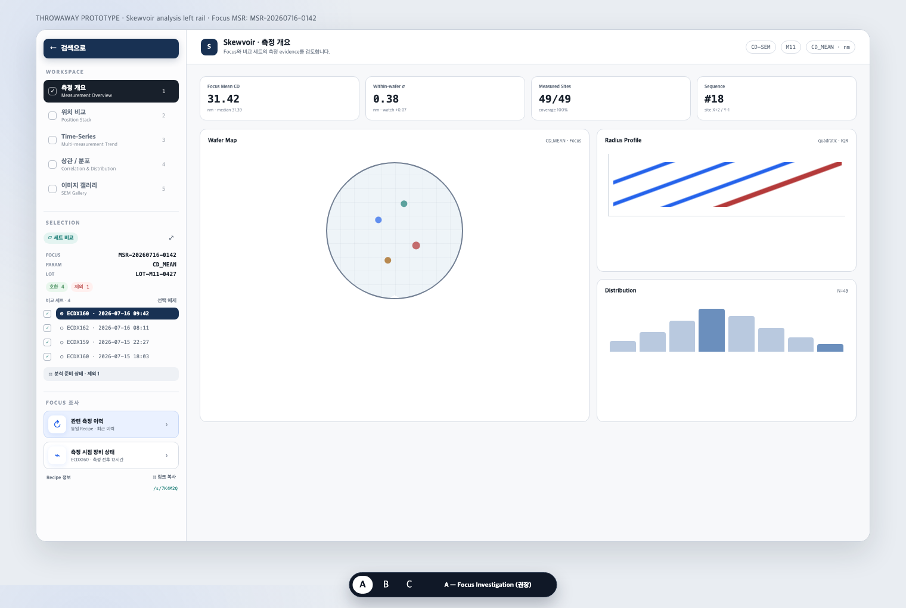
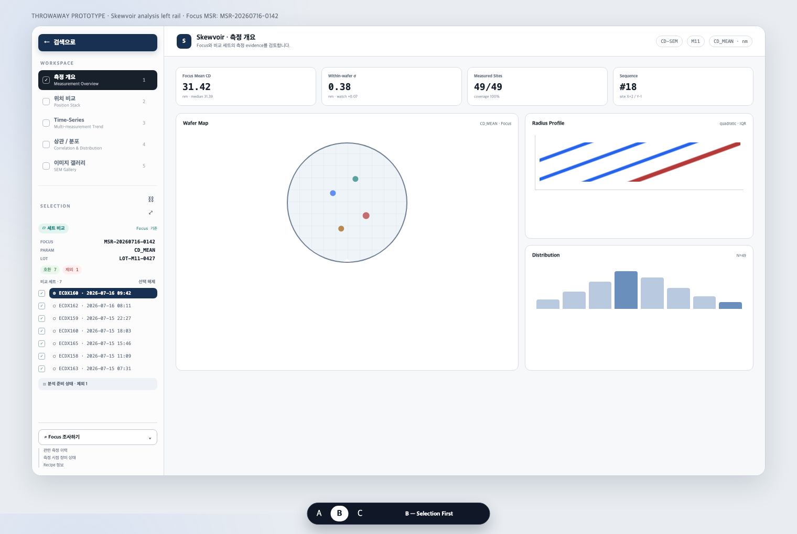
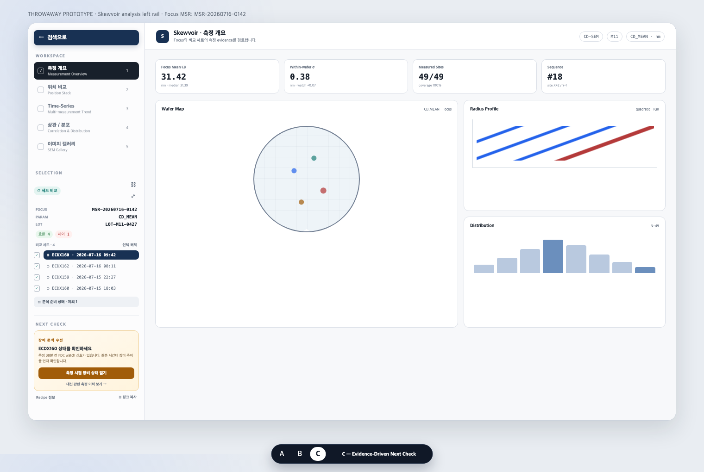

# Skewvoir Actions 영역 프로토타입

> **THROWAWAY PROTOTYPE** — 이 파일과 이미지는 설계 비교용이며 제품 구현이 아닙니다.

## 검토 질문

Skewvoir 분석 화면에서 사용자가 하나 이상의 MSR을 선택했을 때, 왼쪽 레일의
`ACTIONS` 영역을 어떻게 구성해야 후속 조사를 빠르게 이어갈 수 있는지 비교합니다.

현재까지 합의한 방향은 다음과 같습니다.

- Actions의 주 목적은 협업 기록이 아니라 **후속 조사**입니다.
- 다중 MSR 세트에서도 모든 바로가기는 **현재 Focus MSR**을 기준으로 동작합니다.
- 우선 조사 경로는 **관련 측정 이력**과 **측정 시점 장비 상태**입니다.
- Recipe 상세는 보조 경로로 내리고, 동작하지 않는 Annotate는 제거합니다.
- Share는 분석 URL 전체를 복사하는 독립 유틸리티로 유지합니다.

## Variant A — Focus Investigation



Focus MSR 아래에 두 개의 안정적인 조사 경로를 항상 노출합니다.

- `관련 측정 이력`: Focus recipe를 기준으로 측정 이력을 엽니다.
- `측정 시점 장비 상태`: Focus 장비와 측정 시각 주변 범위를 미리 선택합니다.
- `Recipe 정보`와 `링크 복사`는 작은 보조 유틸리티로 둡니다.

**장점:** 목적과 대상이 명확하고 예측 가능합니다. 두 핵심 경로의 발견성이 가장
좋습니다.

**단점:** Selection 영역이 Variant B보다 조금 짧습니다.

## Variant B — Selection First



Selection이 레일 높이를 최대한 사용하고, 후속 조사는 `Focus 조사하기` 메뉴 하나로
접습니다. Share는 Focus 헤더의 아이콘 유틸리티로 이동합니다.

**장점:** 긴 비교 세트를 가장 많이 볼 수 있습니다. 레일이 단순합니다.

**단점:** 조사 경로가 숨겨져 발견성이 낮고, 자주 쓰는 기능에도 한 번 더 클릭해야
합니다.

## Variant C — Evidence-Driven Next Check



분석 결과에 따라 다음 조사 경로 하나를 추천합니다. 예시 화면에서는 Focus MSR
측정 시각 주변에 FDC 신호가 있어 장비 상태 확인을 우선 제안합니다.

**장점:** 사용자가 다음 행동을 결정하는 부담을 줄이고, 분석에서 운영 문맥으로
자연스럽게 연결합니다.

**단점:** 추천 근거가 신뢰할 수 있어야 합니다. 현재 mock 또는 미검증 score를
근거로 사용하면 잘못된 확신을 줄 수 있으므로, 초기 제품 기능으로는 위험합니다.

## 권장안

**Variant A를 1차 구현안으로 권장합니다.** 관련 측정 이력과 장비 상태는 이미 실제
페이지가 있고, 대상도 Focus MSR로 명확하게 계산할 수 있습니다. Variant C의
추천형 구조는 장비 이벤트와 분석 evidence 연결이 검증된 뒤 단계적으로 추가하는
것이 안전합니다.

권장 세부 규칙은 다음과 같습니다.

1. 섹션 이름을 `ACTIONS`에서 `FOCUS 조사` 또는 `FOLLOW-UP`으로 바꿉니다.
2. 버튼마다 현재 대상을 짧게 표시합니다. 예: `동일 Recipe · 최근 이력`,
   `ECDX160 · 측정 전후 12시간`입니다.
3. Focus가 바뀌면 MSR, recipe, fab, equipment, timestamp를 한 번에 다시 계산합니다.
4. 새 탭에서 열어 현재 Skewvoir 분석 상태를 보존합니다.
5. Share는 외부 URL shortener가 아니라 내부 `share_id` 기반 링크로 제공합니다.
6. 단축 링크를 만들 수 없거나 만료되었으면 현재의 전체 URL 복사로 안전하게
   fallback 합니다.

## 단축 링크 계약 제안

현재 분석 URL은 focus, 비교 세트, view, parameter, site, reference, metric, axes,
gallery filter를 재현할 수 있습니다. 단축 링크는 이 URL을 버리는 기능이 아니라,
서버에 저장한 전체 URL을 짧은 ID로 조회하는 별칭이어야 합니다.

```text
POST /api/shared-links
  body: { target_url, title?, expires_in_days? }
  -> { id: "7K4M2Q", short_path: "/s/7K4M2Q", expires_at }

GET /s/7K4M2Q
  -> 권한 확인 후 저장된 Skewvoir URL로 redirect
```

권한, 생성자, 만료 시각, 마지막 접근 시각을 서버에서 관리하며 외부 공개
shortener에는 내부 MSR 식별자를 보내지 않습니다.

## 프로토타입 원본

브라우저에서 [`prototype.html`](prototype.html)을 열고 `?variant=A`, `B`, `C`를
바꾸면 동일한 화면을 직접 비교할 수 있습니다.
