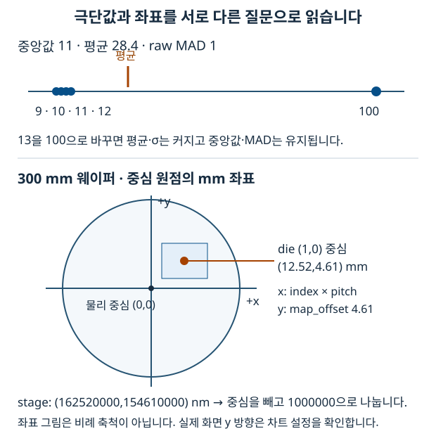

# 12. 통계와 웨이퍼 좌표: 값·단위·집계 수준

계측 화면의 숫자와 점 위치는 계산의 결과입니다. 이 문서는 평균·표준편차부터 시작해 중앙값·MAD, 웨이퍼 물리 좌표와 die 집계를 연결합니다. 공식 자체를 외우기보다 **어떤 집합의 어떤 값을 어떤 단위로 계산했는지** 설명하는 것이 목표입니다. 차트 렌더링은 [11-echarts-dataviz](../11-echarts-dataviz/README.md), 검증은 [13-testing](../13-testing/README.md)에서 이어집니다.

2026-10-03 기준 `stats.ts`, `radialAnalysis.ts`, `outlierDetect.ts`, `anomaly/score.ts`, `boxplotStats.ts`, `waferGeometry.ts`, `waferPoints.ts`, `msrRows.ts`와 각 테스트를 확인했습니다. 원본 Python 환경은 NumPy 2.4.6, pandas 3.0.5, PyArrow 25.0.1입니다. 이 챕터의 화면 계산은 주로 순수 TypeScript 함수이며, Python 패키지 버전을 이유로 TS 계산 규칙이 자동 변경되지는 않습니다.

## 1. 기초: 중심과 산포는 서로 다른 질문입니다

CD(critical dimension)는 측정 대상의 치수입니다. 같은 공정에서도 위치·장비·시간에 따라 값이 달라질 수 있습니다. “대표 값이 얼마인가”는 중심의 질문이고, “얼마나 흩어졌는가”는 산포의 질문입니다.

`[9, 10, 10, 10, 11]`은 중심이 10이며 근처에 모여 있습니다. `[1, 5, 10, 15, 19]`도 중심은 10이지만 산포가 큽니다. 평균 하나만 보고 두 집합을 같다고 판단하면 중요한 차이를 놓칩니다. 또 표본이 비었다면 중심을 실제 측정값 0으로 바꾸면 안 됩니다.

## 2. 용어: 평균·중앙값·σ·MAD

| 용어 | 질문과 정의 | 읽을 때 주의 |
| --- | --- | --- |
| Mean, 평균 | 합계를 개수로 나눈 중심 | 극단값이 합계에 직접 영향을 줍니다. |
| Median, 중앙값 | 정렬한 값의 가운데; 짝수 개는 가운데 둘의 평균 | 평균과 다른 중심입니다. |
| Standard deviation, 표준편차 | 평균 주변 제곱 편차로 구한 산포 | 표본/모집단의 분모를 구분합니다. |
| MAD, Median Absolute Deviation (중앙 절대 편차) | 중앙값 주변 절대 편차의 중앙값 | 원래 MAD와 정규 보정 MAD를 구분합니다. |
| Quantile, 분위수 | 정렬 집합의 일정 비율 위치 | 보간 정의에 따라 값이 달라집니다. |
| Residual, 잔차 | 실제 측정값 − 모델의 예측값 | 측정값 자체의 산포와 다릅니다. |
| LOO, leave-one-out | 평가할 한 점을 빼고 나머지로 기준을 만듭니다. | 자신의 값이 기준을 움직이는 영향을 줄입니다. |
| Die / field | 웨이퍼의 칩 격자와 그 내부 측정 위치 | 집계 수준을 구분합니다. |

표본 표준편차는 `sqrt(sum((x - mean)²) / (n - 1))`입니다. 제곱하기 때문에 먼 값의 영향이 커집니다. MAD는 `median(abs(x - median(x)))`이고, 편차에서도 가운데 값을 선택합니다.

```text
값                         9   10   10   10   11
중앙값                    10
중앙값에서의 절대 편차      1    0    0    0    1
편차를 정렬                0    0    0    1    1
raw MAD                    0
```

**MAD 0은 모든 측정값이 같다는 뜻이 아닙니다.** 절반 이상이 같은 중심값이면 다른 값이 있어도 MAD가 0일 수 있습니다. 따라서 MAD를 분모로 쓰는 식에는 0·표본 부족·결측 처리 규칙이 필요합니다.

## 3. 현재 구현: 통계부터 위치까지

### 3.1 이상치 하나가 들어왔을 때 비교합니다

| 데이터 | 평균 | 중앙값 | 표본 표준편차 | raw MAD | MAD × 1.4826 |
| --- | --- | --- | --- | --- | --- |
| `[9, 10, 11, 12, 13]` | 11 | 11 | 약 1.5811 | 1 | 1.4826 |
| `[9, 10, 11, 12, 100]` | 28.4 | 11 | 약 40.0412 | 1 | 1.4826 |

표본 끝의 13을 100으로 바꾸면 평균과 표준편차는 크게 변하지만 중앙값과 MAD는 유지됩니다. 로버스트(robust)란 이런 일부 극단값의 영향에 덜 민감하다는 뜻입니다. 중앙값의 breakdown point가 약 50%라고 해서 데이터 절반이 임의로 오염돼도 항상 정확하다는 보장은 아닙니다. 작은 표본·중복값·분포 모양도 봐야 합니다.

`stats.ts`의 `medianAbsoluteDeviation()`은 **raw MAD**를 반환합니다. `MAD_TO_SIGMA = 1.4826`은 정규분포 아래에서 σ 크기에 맞추는 상수입니다. 보정한 값이 모든 분포에서 일반 표준편차와 같아지는 것은 아닙니다. 두 숫자의 차이는 극단값·꼬리·분포 모양을 살피는 신호이지, 차이가 난다는 이유만으로 장비 불량을 확정하는 판정은 아닙니다.

일반 z-score는 `(x - mean) / std`입니다. 이론적인 modified z-score는 대략 `(x - median) / (1.4826 × raw MAD)`로 설명할 수 있습니다. 그러나 **현재 `radialAnalysis.ts`가 이 식으로 각 점의 이상 판정을 수행하는 것은 아닙니다.** 그 파일은 곡선을 적합하고 잔차의 보정 MAD를 `residualMad` 품질 지표로 제공합니다. 정규식처럼 보이는 공식을 보고 실제 사용처까지 추측하지 않습니다.



그림은 이해를 위한 도식이며 실제 축척이 아닙니다. 좁은 HTML 화면에서는 그림 안을 좌우로 이동해 전체를 볼 수 있습니다.

### 3.2 `stats.ts`의 반환 규칙을 먼저 읽습니다

| 함수 | 현재 동작 | 입력 경계 |
| --- | --- | --- |
| `mean` | 합/개수, 빈 배열은 `NaN` | 비유한 값을 자동 제거하지 않습니다. |
| `median` | 정렬 복사 후 R-7의 p=0.5, 빈 배열은 `NaN` | 입력 정제를 호출부가 확인합니다. |
| `sampleStd` | 평균을 구한 뒤 편차 제곱을 합하는 2-pass n−1 | n<2는 구현상 0입니다. |
| `quantileSorted` | R-7 선형 보간, 빈 배열은 `NaN` | 정렬·정제와 유효 p는 호출부 책임입니다. |
| `medianAbsoluteDeviation` | raw MAD, 중심이 비유한 값이면 `NaN` | 보정 상수를 내부에서 곱하지 않습니다. |
| `iqrFences` | 유한 값 필터 후 Tukey 1.5×IQR (Interquartile Range, 사분위 범위) 울타리 | 빈 유효 집합은 `null`입니다. |
| `pearson` | 선형 상관, 유한 쌍 필터 후 n≥3·양쪽 분산 필요 | 정의 불가면 `null`입니다. |
| `spearman` | 동순위 평균 순위를 구한 뒤 Pearson | 순서상 단조 관계를 봅니다. |

`sampleStd([])`와 `sampleStd([10])`의 0은 작은 표본에 대한 현재 함수의 처리 규칙입니다. “산포가 충분히 검증돼 0”이라는 뜻으로 해석하면 안 됩니다. 통계 함수마다 결측 규칙이 다르므로 전부 “빈 배열은 null”이라고 일반화하지 않습니다.

2-pass 계산은 큰 평균에서 작은 분산을 빼는 `sum(x²)/n - mean²` 형태의 상쇄 문제를 줄입니다. R-7은 `(n-1)*p` 위치에서 이웃 값 사이를 선형 보간합니다. NumPy 2.4의 기본 `quantile(method='linear')`와 같은 계열입니다. [NumPy 2.4 분위수 문서](https://numpy.org/doc/2.4/reference/generated/numpy.quantile.html)를 참고합니다.

표준편차를 Python과 비교할 때도 분모를 맞춰야 합니다. NumPy 기본 `std`는 `ddof=0`이고, 이 TS 함수의 표본 표준편차와 비교하려면 `ddof=1`입니다. [NumPy 2.4 std 문서](https://numpy.org/doc/2.4/reference/generated/numpy.std.html)에서 확인할 수 있습니다.

### 3.3 산포·곡선 적합·이상 판정은 같은 일이 아닙니다

`radialAnalysis.ts`는 반경 위치와 CD의 관계를 모델로 적합합니다. 잔차는 `측정 CD - 곡선 예측 CD`입니다. `residualMad`는 잔차 중앙값 주위의 MAD에 1.4826을 곱한 값입니다. `residualStd`는 `SSE (Sum of Squared Errors, 제곱 오차 합) / (표본 수 - 모델 파라미터 수)`의 제곱근입니다. 일반 `sampleStd(residuals)`와 분모가 다르며, 자유도가 없으면 `null`입니다. RMSE (Root Mean Square Error, 평균 제곱근 오차), R² (결정계수), adjusted R² (보정 결정계수), LOO 기반 cvRmse (교차 검증 RMSE)도 서로 다른 질문에 답합니다. 작은 MAD 하나만으로 적합·장비 상태를 단정하지 않습니다.

실제 판정은 사용처별로 구분합니다.

- `outlierDetect.ts`: 측정량(point_count)의 중앙값 × 배수를 **초과**하면 과다 측정으로 표시합니다. 기본 배수는 2이고 `>`를 쓰므로 문턱과 같은 값은 제외합니다. `_CDU`, `_FULL`, `_HALF`, `_MTX` 같은 면제 job과 맨 앞의 Dummy/Align 도움 파라미터를 기준선·표시 대상 모두에서 제외합니다. 이름이 같은 도움 파라미터라도 뒤쪽 진짜 측정을 무조건 제거하지 않습니다. 빈 판단 집합의 중앙값은 이 함수에서는 0입니다.
- `anomaly/score.ts`: `scoreByRange`는 LOO 중심 대비 퍼센트 편차의 권위 있는 판정이고, `scoreByStddev`는 σ 단위 진단입니다. 미평가는 `status: 'insufficient'`로 보존합니다. 미평가 결과의 `severity`가 normal이라고 해서 평가를 통과한 정상으로 읽으면 안 됩니다.
- `iqrFences`: CD 분포의 whisker 렌더링 경계입니다. 자동으로 판정 상태를 만들거나 원자료를 삭제하지 않습니다.

`boxplotStats.ts`의 fleet 박스플롯은 진짜 min/max를 유지합니다. 장비 4~6대의 작은 집합에서 IQR 밖 값을 숨기면 실재 장비가 시야에서 사라질 수 있기 때문입니다. 박스의 Q1·중앙값·Q3와 whisker 정책을 별도로 읽습니다.

### 3.4 웨이퍼 좌표의 원점과 단위를 맞춥니다

현재 `waferGeometry.ts`의 대표 데이터는 다음과 같습니다.

| 원자료 | 의미 | 원자료 단위 / 형식 |
| --- | --- | --- |
| `chip_number` | 기준 die에 상대적인 `(col,row)` | 숫자 격자 문자열 |
| `stage_coordinate` | 코너 원점의 측정 물리 위치 | x,y의 nm 문자열 |
| `wafer_size` | 웨이퍼 지름 | 현재 nm 문자열 `"300000000"` |
| `chip_pitch` | die 중심 사이의 간격 | nm 문자열 `"12520000,10340000"` |
| `map_offset` | 웨이퍼 중심 대비 die 격자 이동 | nm 문자열 `"0,4610000"` |
| `map_origin` | 배열 안의 기준 die 인덱스 | `"12,15"`; 배치식에 다시 더하지 않습니다. |

실제 입력의 `wafer_size`는 nm입니다. 레거시 `"300"` mm도 받아들이며 현재 parser는 값이 1000 이상이면 nm로 해석합니다. 이것은 일반 단위 자동 추론이 아니라 알려진 웨이퍼 지름 범위에 맞춘 호환 규칙입니다. `1 mm = 1,000,000 nm`입니다.

```text
코너 원점 좌표                      중심 원점으로 옮긴 좌표
stage x = 162,520,000 nm             x = (162,520,000 - 150,000,000)
stage y = 154,610,000 nm                  / 1,000,000 = 12.52 mm
300 mm 웨이퍼 중심 = 150,000,000 nm   y = 4.61 mm
```

`stagePosMm()`는 물리 중심을 빼고 nm→mm로 나눕니다. **물리 좌표에는 `map_offset`을 빼지 않습니다.** 중심→edge 효과를 분석하는 반경은 이 물리 원점을 기준으로 해야 합니다.

`dieCenterMm(col,row)`는 격자 중심이므로 `offset + index × pitch`입니다. 위 예시의 die `(1,0)`은 `(0 + 1×12.52, 4.61 + 0×10.34) = (12.52,4.61) mm`입니다. `map_origin`은 배열에서 기준 die가 어디인지의 정보이고, `chip_number`가 이미 상대 인덱스라 다시 12·15를 더하면 이중 이동입니다.

`snapToDieCell()`은 물리 위치에서 격자 offset을 뺀 뒤 pitch로 나누고 반올림합니다. pitch가 없으면 `null`이며 가짜 `(0,0)`을 만들지 않습니다. `siteRadiusMm()`는 `hypot(x,y)`로 실제 웨이퍼 중심에서의 거리를 구합니다. 격자 이동량과 물리 반경을 섞으면 radial plot의 x가 틀어집니다.

현재 parser는 결측 size를 300mm, pitch를 0, 잘못된 offset을 0으로 처리합니다. `stagePosMm`·`parseChipXY`는 성분 수와 유한수를 확인하지만 JavaScript의 `Number('')`는 0입니다. 따라서 “모든 잘못된 문자열을 엄격히 거부한다”는 설명은 현재 구현보다 강한 주장입니다. 일반 단위·입력 검증 라이브러리로 생각하지 않고 테스트한 계약 범위 안에서 사용합니다.

### 3.5 같은 웨이퍼라도 field와 die는 다른 데이터입니다

`msrRows.ts`의 측정 여부는 `mp_number >= 0`, `cd_value != null`, 유한 CD를 함께 확인합니다. metadata만 있는 음수 mp 행을 평균에 넣거나 null을 0으로 바꾸지 않습니다.

`buildWaferPoints(rows, geo)`의 입력 rows는 호출부에서 한 파라미터로 좁힌 집합이어야 합니다. 함수가 여러 파라미터를 자동 분리하지 않습니다.

- `fieldPoints`: 측정 행 하나당 한 점입니다. 물리 위치를 사용하고 `n=1`, `seqs=[sequence]`입니다. 유효 chip·stage를 파싱하지 못하면 배치하지 않습니다.
- `diePoints`: 같은 `chip_number`를 묶고 CD 평균을 구합니다. 점은 실제 측정 위치의 평균이 아니라 **offset을 포함한 die 격자 중심**에 둡니다. `n`과 `seqs`에 합쳐진 행 수와 sequence를 남깁니다.
- `failurePoints`: 측정 조건을 만족하지 않는 행의 물리 위치입니다. 이름이 failure이더라도 모든 점이 원인 확인된 장비 고장이라는 뜻은 아닙니다.

예를 들어 한 die에서 CD 10·12nm 두 행을 측정했다면 field는 서로 다른 물리 위치의 두 점이고 die는 중심에 놓인 11nm 한 점입니다. 원자료의 튄 점이 평균에 가려질 수 있으므로 집계 지도를 개별 측정과 같은 해상도로 읽지 않습니다. 표시 값은 소수 셋째 자리로 반올림되며 원자료 정밀도와 표시 정밀도도 구분합니다.

## 4. 선택 이유와 한계

통계·좌표 계산을 순수 함수로 모으면 반복 공식과 단위 변환을 줄이고 브라우저 없이 엣지 케이스를 검증할 수 있습니다. 동일 숫자 타입에 단위가 자동 포함되는 것은 아니므로 변수명과 경계의 변환이 중요합니다.

MAD는 극단값에 덜 민감한 산포 지표이고 일반 σ는 전체 제곱 편차를 반영합니다. 한쪽을 전부 다른 쪽으로 대체하는 것이 목표가 아닙니다. 측정량 판정, CD 분포, radial fit의 잔차는 서로 다른 표본·목적입니다. 현재 코드가 선택한 규칙을 먼저 읽고 도메인 검증으로 바꿉니다.

집 mock·순수 테스트는 코드가 명시한 좌표 계약을 확인합니다. 실제 회사 자료의 단위·origin·offset, stage 방향·notch 방향까지 검증한 것은 아닙니다. 사내 확인 결과는 해당 datatable과 mock에 같이 반영해야 합니다.

## 5. 흔한 실수

- raw MAD와 보정 MAD를 섞거나 1.4826을 두 번 곱하면 잘못된 산포가 됩니다.
- NumPy의 기본 표준편차와 TS 표본 표준편차를 비교하면서 `ddof` 차이를 놓칩니다.
- MAD 0, 표본 부족, `null`을 정상 확정으로 바꾸면 아직 모르는 상태가 숨겨집니다.
- `wafer_size="300000000"`을 mm로 쓰면 지름이 백만 배 커집니다.
- stage 좌표에 map_offset을 적용하면 물리 중심 기준 반경이 움직입니다.
- die 배치에서 offset을 빼먹거나 map_origin을 다시 더하면 격자와 점이 어긋납니다.
- 파라미터를 나누지 않고 die 평균을 구하면 다른 치수의 측정들이 섞입니다.
- field의 개별값과 die의 평균을 같은 데이터라고 읽으면 국소 이상을 놓칩니다.

## 6. 안전한 실습

`frontend/`에서 다음 순수 계산을 실행합니다. DB·브라우저·서버가 필요하지 않습니다.

```bash
node --input-type=module <<'JS'
import { mean, median, sampleStd, medianAbsoluteDeviation } from './app/utils/stats.ts'
for (const values of [[9, 10, 11, 12, 13], [9, 10, 11, 12, 100]]) {
  console.log({ mean: mean(values), median: median(values),
    std: sampleStd(values), mad: medianAbsoluteDeviation(values) })
}
JS
```

첫 집합은 평균·중앙값 11, std 약 1.5811, MAD 1입니다. 두 번째는 평균 28.4, 중앙값 11, std 약 40.0412, MAD 1입니다. 어느 지표가 무엇에 반응했는지 설명합니다.

```bash
node --input-type=module <<'JS'
import { parseWaferGeometry, stagePosMm, dieCenterMm, snapToDieCell } from './app/utils/waferGeometry.ts'
const geo = parseWaferGeometry({ wafer_size: '300000000',
  chip_pitch: '12520000,10340000', map_offset: '0,4610000', map_origin: '12,15' })
console.log(geo.sizeMm, stagePosMm('162520000,154610000', geo))
console.log(dieCenterMm(1, 0, geo), snapToDieCell('162520000,154610000', geo))
JS
```

기대 결과는 size 300, 물리 위치 `[12.52,4.61]`, die 중심 `[12.52,4.61]`, cell 문자열 `1,0`입니다. 실제 측정점이 항상 die 중심과 같은 것은 아니며 이 예시는 계산을 쉽게 보기 위한 값입니다.

```bash
node --test app/utils/stats.test.ts app/utils/radialAnalysis.test.ts \
  app/utils/outlierDetect.test.ts app/utils/waferGeometry.test.ts \
  app/utils/waferPoints.test.ts app/utils/waferChip.test.ts
```

학습 완료 기준은 “MAD가 더 좋다”를 외우는 것이 아닙니다. raw·보정 MAD, n−1·모델 자유도, nm·mm, 물리 원점·격자 offset, field·die 각각의 차이와 현재 함수의 결측 반환값을 설명할 수 있어야 합니다.


## 실제 계산 근거

- [stats.ts](../../../frontend/app/utils/stats.ts), [radialAnalysis.ts](../../../frontend/app/utils/radialAnalysis.ts): 중심·산포·적합 품질입니다.
- [outlierDetect.ts](../../../frontend/app/utils/outlierDetect.ts), [anomaly/score.ts](../../../frontend/app/utils/anomaly/score.ts): 서로 다른 실제 판정 경계입니다.
- [waferGeometry.ts](../../../frontend/app/utils/waferGeometry.ts), [waferPoints.ts](../../../frontend/app/utils/waferPoints.ts), [msrRows.ts](../../../frontend/app/utils/msrRows.ts): 원점·단위·집계와 측정 유효성입니다.
