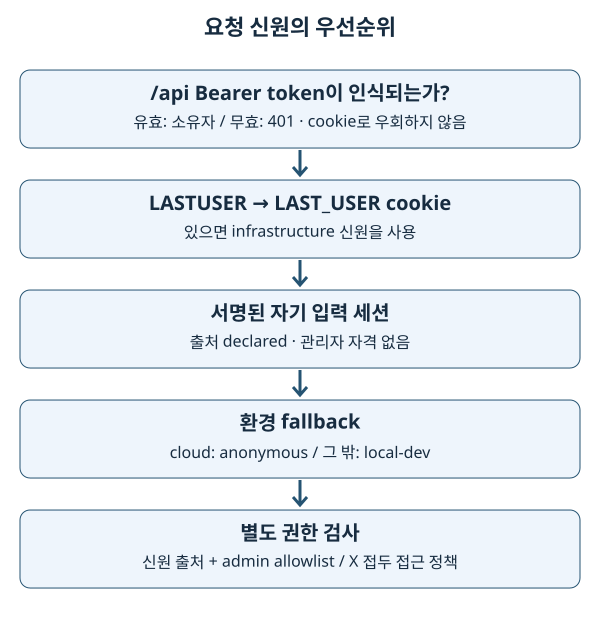

# 15. 프로세스·스레드·신원·활동 로그

> **2026-10-03 구현 대조.** 서버가 한 번 응답했다는 것과 정기 작업·권한·로그가 올바르게 작동한다는 것은 다른 증거입니다. 이 장에서는 성공한 HTTP 응답 뒤에 남는 운영 상태를 설명합니다.

## 1. 기초 개념: 실행 중인 프로그램과 사용자

프로세스는 운영체제가 실행하는 프로그램 단위이며 자신의 메모리를 가집니다. 스레드는 한 프로세스 안에서 메모리를 공유하며 실행하는 흐름입니다. Python 전역 변수는 다른 uWSGI 프로세스의 전역 변수와 자동으로 동기화되지 않습니다. 요청마다 임시로 보관할 상태와 여러 요청·프로세스가 공유할 상태도 다릅니다.

사용자가 누구인지 알아내는 일과 그 사용자에게 특정 기능을 허용하는 일은 분리됩니다. 로그에 사번이 보인다고 관리자 권한을 주면 안 됩니다. 신원의 출처도 확인해야 합니다.

## 2. 전문 용어

| 용어 | 뜻 |
| --- | --- |
| worker | 서버 요청을 처리하는 실행 단위입니다. uWSGI에서는 worker 프로세스입니다. |
| I/O (Input/Output) | 네트워크·파일 읽기/쓰기입니다. 기다리는 동안 CPU 계산과 다른 병목이 발생합니다. |
| GIL (Global Interpreter Lock) | 일반 CPython이 Python 객체 접근을 조정하는 전역 잠금입니다. 스레드 16개가 순수 Python 계산을 16배 빠르게 한다는 뜻은 아닙니다. |
| scheduler | 시각이나 주기에 맞춰 작업을 실행하는 장치입니다. |
| cron trigger | ‘매일 지정 시각’ 같은 달력 조건입니다. 실행 중단 후 누락을 반드시 복구한다는 뜻은 아닙니다. |
| lock / TTL (Time To Live) | 동시 실행을 막는 잠금 / 유효 시간입니다. 잠금 소유자가 죽었을 때 영구 정지를 피하도록 만료를 둡니다. |
| authentication / authorization | 신원을 확인하는 인증 / 행동을 허용하는 인가입니다. |
| cookie / session | 브라우저가 요청에 붙이는 값 / 여러 요청에 걸친 상태입니다. Flask 기본 세션은 서명된 클라이언트 쿠키이며 암호화 저장소가 아닙니다. |
| Bearer token | 가진 사람이 사용할 수 있는 API 자격 증명입니다. 평문은 비밀입니다. |
| debounce | 짧은 시간 반복되는 이벤트를 줄이는 기법입니다. 방문수 집계와 모든 HTTP 요청수를 같게 만들지 않습니다. |
| observability, 관측 가능성 | 로그·진단값으로 시스템 상태를 설명하는 능력입니다. 로그 적재 실패도 관측되어야 합니다. |

## 3. 이 저장소의 구현

### 3.1 uWSGI의 4 × 4와 정기 작업 하나

[wsgi.ini](../../../wsgi.ini)는 worker 프로세스 4개, 각 요청 스레드 4개를 선언합니다. 이는 요청 처리 슬롯 16개라는 설정상 상한이며 실제 처리량을 보장하는 수치가 아닙니다. FTP (File Transfer Protocol) 다운로드처럼 요청 안에서 기다리는 작업이 슬롯을 점유합니다.

`lazy-apps = true`는 worker마다 Flask app을 생성하게 합니다. `enable-threads = true`는 앱의 백그라운드 스레드가 작동하는 데 필요합니다. [election.py](../../../backend/_scheduler/election.py)는 uWSGI worker 1만 scheduler 소유자로 선출합니다. 개발 reloader에서는 감시 부모가 아닌 실행 자식만 선출합니다. `index.py`가 `FLASK_DEBUG`를 app 생성 전에 정하는 이유입니다.

```text
uWSGI master
 ├─ worker 1: 요청 스레드 4 + scheduler 소유
 ├─ worker 2: 요청 스레드 4
 ├─ worker 3: 요청 스레드 4
 └─ worker 4: 요청 스레드 4
```

[스케줄러 시작](../../../backend/_scheduler/__init__.py)은 APScheduler 3의 `BackgroundScheduler`를 사용합니다. 일정은 [registry.py](../../../backend/_scheduler/registry.py)에 선언되고 시간대는 `Asia/Seoul`입니다. 기본 memory job store는 예약 정의를 부팅 때 재구성합니다. 작업 실행 로그나 잠금의 Redis 사용 여부와 예약 저장소는 별개입니다. 중단 중 놓친 실행을 영속 큐처럼 반드시 재생하지 않는 것이 현재 한계입니다.

[locks.py](../../../backend/_scheduler/locks.py)의 사내 Redis 잠금에는 소유 토큰과 만료 갱신이 있습니다. TTL 기본 600초는 살아 있는 작업의 최대 실행 시간으로 해석하면 안 됩니다. 죽은 소유자의 잠금을 언젠가 해제하는 시간입니다. 다른 프로세스가 자신의 잠금이 아닌 값을 지우지 않도록 해제 조건도 검사합니다. 집에서는 메모리 잠금을 사용합니다.

재시작 작업과 로그 삭제 작업도 정기 작업입니다. 따라서 실습에서 scheduler를 켜고 factory를 반복 생성하지 않습니다. 테스트의 루트 [conftest.py](../../../conftest.py)는 scheduler 비활성화를 설정합니다.

### 3.2 요청 신원의 우선순위



[_auth/middleware.py](../../../backend/_auth/middleware.py)를 다음 순서로 읽습니다.

1. `/api/*`의 `Authorization: Bearer …`가 인식되면 API token을 검사합니다. 유효하지 않으면 401이고 cookie fallback으로 바꾸지 않습니다.
2. token 경로가 아니면 `LASTUSER`, 다음으로 `LAST_USER` cookie를 읽습니다. 빈 값은 신원 없음으로 처리합니다.
3. cookie가 없으면 서명된 자기 입력 세션을 읽습니다. 출처는 `declared`입니다.
4. 없으면 [_auth/provider.py](../../../backend/_auth/provider.py)의 환경별 fallback을 사용합니다. cloud 경로 밖은 `local-dev`, cloud는 `anonymous`입니다.

**중요한 경계:** data provider의 office mode와 identity의 cloud 여부는 같은 조건이 아닙니다. 사무실 localhost는 office 데이터를 읽으면서도 cookie가 없으면 local fallback일 수 있습니다. 사내 배포 경로 오류는 단순 파일 오류가 아니라 신원 기본값 문제입니다.

[_auth/admin.py](../../../backend/_auth/admin.py)는 사용자 ID allowlist와 신원 출처를 함께 검사합니다. 허용 출처는 token·cookie·local이며 declared·anonymous는 관리자 자격이 없습니다. 관리자의 사번을 직접 입력하는 것만으로 관리자 API를 열 수 없습니다. X 접두 신원은 [access_control](../../../backend/access_control/routes.py)의 예외 정책과 함께 API 접근을 검사합니다. 화면 파일은 내려줘야 차단 이유를 보여줄 수 있으므로 자산 접근과 업무 API 차단을 구분합니다.

Nuxt의 `/identify` 유도는 사용자 안내입니다. API를 직접 호출하는 클라이언트를 막는 서버 권한 경계가 아닙니다. 인증의 일반적인 의미와 이 사내망 앱의 제한된 신원 정책을 구분해야 합니다. 외부 인터넷에 공개하기 위한 인증 체계를 구현했다고 해석하지 않습니다.

### 3.3 요청 로그와 페이지 열기 로그

[pageView.client.ts](../../../frontend/app/plugins/pageView.client.ts)는 최초 로드와 route 이동을 보고합니다. [pageIdentity.ts](../../../frontend/app/utils/pageIdentity.ts)는 장비 family와 feature를 묶어 페이지 정체성을 정하며 fab·필터 변경을 단순 페이지 열기와 구분합니다. family는 `/api/page-view/<family>` 경로로 전달됩니다. frontend와 backend는 [공유 fixture](../../../frontend/app/utils/__fixtures__/pageIdentityContract.json)로 계약을 검사합니다.

[_logging/activity.py](../../../backend/_logging/activity.py)는 `before_request`, `after_request`, `teardown_request`에서 시간·상태·신원 출처·기능·요청 ID 등을 기록합니다. Flask `g`는 요청 맥락의 상태이며 모든 요청이 공유하는 전역 dict가 아닙니다. OpenSearch 계측의 ContextVar 정리도 다음 요청의 시간이 섞이지 않게 합니다. route 전에 차단된 요청은 정상 route 수행 시간과 다르게 보일 수 있습니다.

[_logging/opensearch_handler.py](../../../backend/_logging/opensearch_handler.py)는 제한된 queue에 넣고 daemon thread가 bulk 적재합니다. 응답 성공은 적재 성공 보장이 아닙니다. queue overflow·bulk 실패에는 dropped 진단값이 있습니다. 대상 rollover alias와 `SKEWNONO_LOG_ENV`를 확인해야 하며 [health routes](../../../backend/health/routes.py)의 관리자 logging 진단을 이용합니다.

### 3.4 속도 제한과 비동기 대화

Factory는 `/api/` 전체에 사용자당 5초 50회 공유 제한을 설정합니다. 현재 `msr_image`, `afm`, `fail_issue`, `recipe_tat` Blueprint는 예외입니다. 집에서는 메모리 카운터, office mode에서 `REDIS_HOST`가 있으면 공유 Redis 카운터를 사용합니다. Redis 장애 시 메모리 fallback은 응답을 유지하지만 worker별 카운터가 되어 전체 제한 강도가 달라집니다.

[chat/orchestration.py](../../../backend/chat/orchestration.py)는 대화 턴을 daemon thread로 넘깁니다. POST의 202는 ‘접수됨’이지 ‘답변 완료’가 아닙니다. SQLite에 pending 상태를 남기고 클라이언트가 결과를 확인합니다. 프로세스가 종료되면 thread도 사라지므로 영속 작업 큐와 같지 않습니다. [chat/store.py](../../../backend/chat/store.py)의 stale pending 처리가 이러한 중단을 사용자에게 남깁니다.

## 4. 선택 이유와 한계

여러 요청 스레드는 사내 데이터 대기 중 다른 요청이 진행될 여지를 줍니다. scheduler 단일 소유와 잠금은 중복 작업 비용을 줄입니다. 하지만 프로세스 재기동 동안 일정이 잠시 끊기며, HTTP worker 강제 종료는 그 안의 다른 요청과 백그라운드 턴에도 영향을 줍니다. 추적된 `harakiri = 720`과 실제 운영 영구 설정은 별도 확인해야 합니다.

신원 출처를 남기면 cookie 누락과 실제 익명을 구분할 수 있습니다. 활동 로그는 사용자에게 지연을 주지 않도록 적재를 분리하지만 일부 손실을 허용하는 한계가 있습니다. 중요한 감사 행위를 추가한다면 현재 telemetry 경로의 손실 허용이 요구사항을 만족하는지 먼저 판단합니다.

## 5. 흔한 실수

- 전역 dict로 worker 간 공유를 구현했다고 생각하면 상태가 요청마다 달라질 수 있습니다. Redis·SQLite 등 실제 공유 경계를 확인합니다.
- scheduler를 모든 worker에서 실행하면 정리·snapshot 작업이 중복됩니다. app 생성 시점과 선출부터 봅니다.
- 비어 있지 않은 환경변수를 무조건 true로 처리하면 `false`도 켜집니다. 실제 파서를 확인합니다.
- IP (Internet Protocol) 주소를 고치려고 무조건 proxy trust를 켜면 직접 접속자의 헤더를 신뢰하게 됩니다. 현재 opt-in은 `X-Forwarded-For` 한 단계만 신뢰합니다.
- 관리자 신원을 로그의 사번만으로 검사하면 declared와 실제 cookie 신원을 섞습니다. `is_admin_request()` 경계를 따릅니다.
- 방문수 증가와 API 호출 증가를 같은 지표로 읽으면 이미지 fan-out과 polling 때문에 잘못된 결론을 내립니다.

## 6. 안전한 실습과 확인

저장소 루트에서 읽기 전용 탐색을 먼저 합니다. 작업 실행·토큰 발급·삭제 API는 호출하지 않습니다.

```bash
rg -n 'processes|threads|lazy-apps|harakiri' wsgi.ini
rg -n 'is_scheduler_worker|SKEWNONO_SCHEDULER_ENABLED' backend/_scheduler conftest.py
rg -n 'SOURCE_|is_admin_request|Bearer' backend/_auth
```

‘토큰 없음·cookie 없음·declared 없음’이라는 입력을 종이에 적고 home와 cloud의 출력을 각각 예상합니다. home는 `local-dev/local`, cloud는 `anonymous/anonymous`입니다. 이어서 declared에 관리자 사번을 썼을 때 ID 일치는 가능해도 관리자 출처 조건이 실패하는 이유를 설명합니다.

이미 실행 중인 집 mock 서버에서 `/api/health/jobs`와 `/api/health/logging`을 한 번씩 읽어 봅니다. job을 직접 실행하지 않습니다. 사내 검증은 실제 worker ID·Redis lock·로그 alias 적재·cookie 전달·토큰 폐기 상태를 승인된 관리자 환경에서 별도로 확인해야 합니다.

## 근거와 공식 문서

- [APScheduler 3.x 사용자 가이드](https://apscheduler.readthedocs.io/en/3.x/userguide.html) — 예약·trigger·executor의 역할과 기본 memory job store를 확인했습니다.
- [Flask 3.1 lifecycle](https://flask.palletsprojects.com/en/stable/lifecycle/) — request hook 순서의 근거입니다.
- [Python 3.11 threading](https://docs.python.org/3.11/library/threading.html) — daemon thread와 프로세스 종료의 일반 개념입니다.
- [운영 배포 원문](../../deployment.md) — 실제 사내 검증 결과를 이 학습 문서의 로컬 확인과 구분합니다.
