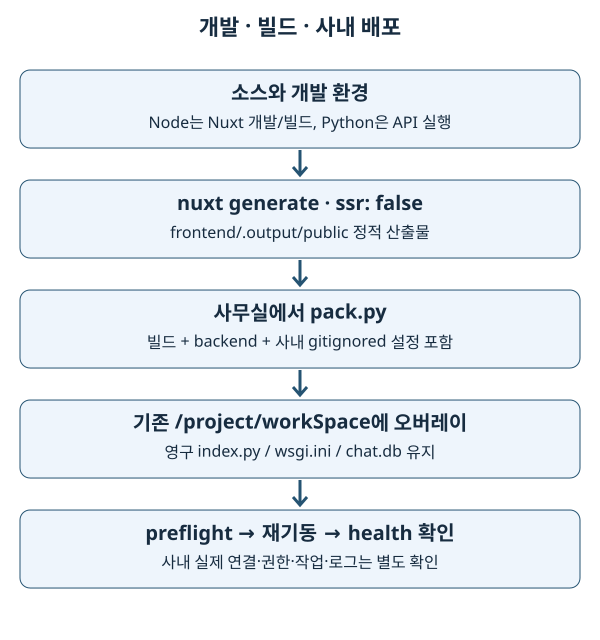

# 16. 저장소·데이터 형식·사내 빌드와 배포

> **2026-10-03.** 이 장의 office 설명은 추적된 template와 배포 코드의 의도입니다. 현재 사내 데이터·배포된 gitignored adapter는 여기서 실행 검증하지 않았습니다.

## 1. 기초 개념: 데이터가 사는 곳과 모양

‘데이터베이스에 있다’는 말만으로는 수정 영향을 알 수 없습니다. 장비 목록은 Redis에서 올 수 있고, 측정 이력은 OpenSearch에서 찾아 실제 파일은 MinIO에서 가져올 수 있습니다. 브라우저 선택 상태는 localStorage, 대화 이력은 SQLite입니다. 각 저장소는 수명·공유 범위·장애 방식이 다릅니다.

데이터 형식은 내용을 담는 규칙입니다. JSON은 교환하기 편하지만 Python DataFrame 타입과 실행 코드를 보존하지 않습니다. pickle은 Python 객체를 복원하지만 신뢰와 라이브러리 버전에 의존합니다. 이미지의 TIFF와 WebP는 저장·열람 목적이 다릅니다. 파일 확장자를 바꾸는 것과 내용을 변환하는 것도 다릅니다.

## 2. 전문 용어

| 용어 | 뜻 |
| --- | --- |
| Redis | key-value·hash·list 등 자료구조를 빠르게 읽고 쓰는 서비스입니다. 단순히 ‘캐시’라는 말만으로 영속 정책을 단정하지 않습니다. |
| OpenSearch index / alias | 검색 문서 저장 단위 / 하나 이상의 index를 가리키는 이름입니다. rollover alias는 쓰기 대상 index를 바꾸며 유지됩니다. |
| MinIO / object storage | S3 호환 객체 저장 서비스 / key로 파일 바이트를 보관하는 저장 방식입니다. bucket은 객체들의 논리적 묶음입니다. |
| SQLite | 별도 DB 서버 없이 파일에 저장하는 관계형 데이터베이스입니다. 여러 worker가 같은 파일을 사용할 수 있지만 쓰기 경합은 존재합니다. |
| WAL (Write-Ahead Logging) | 수정 내용을 먼저 별도 로그에 쓰는 SQLite 모드입니다. 읽기와 쓰기의 공존을 돕지만 동시 writer를 무제한 허용하지 않습니다. |
| serialization, 직렬화 | 객체를 저장·전달 가능한 형태로 바꾸는 것입니다. 역직렬화는 원래 구조를 복원합니다. |
| pickle | Python 객체 직렬화 형식입니다. 역직렬화 과정에서 코드가 실행될 수 있으므로 신뢰되지 않은 파일에 사용하지 않습니다. |
| TIFF (Tagged Image File Format) | 계측 원본에도 쓰이는 이미지 형식입니다. 브라우저가 직접 표시하기 어려울 수 있습니다. |
| WebP | 브라우저 열람용 이미지 형식입니다. preview는 원본 계측 데이터와 목적이 다릅니다. |
| RAG (Retrieval-Augmented Generation) | 자료를 검색해 생성 모델의 답변에 연결하는 방식입니다. 검색 index와 대화 이력은 다른 저장소입니다. |
| overlay, 오버레이 | 기존 디렉터리에 배포 파일을 덮어 넣는 방식입니다. 운영 영속 파일까지 통째로 교체하는 것이 아닙니다. |
| preflight | 실행 전 구조·설정을 검사하는 사전 점검입니다. 실제 네트워크·데이터 정확성을 모두 증명하지 않습니다. |

## 3. 이 저장소의 구현

### 3.1 저장소별 역할과 확인 범위

| 저장소·형식 | 코드에서 확인한 사용 | 집·사내 검증 구분 |
| --- | --- | --- |
| Redis | office adapter 데이터, rate limit, scheduler lock/runlog 등입니다. | home mock의 dict가 실제 Redis 영속성·권한을 증명하지 않습니다. |
| OpenSearch | office 측정/업무 검색·집계, 활동 로그 적재·조회입니다. | index schema·alias·부분 응답은 실제 사내 확인이 필요합니다. |
| MinIO | MSR pickle·원본 파일 등 객체를 가져옵니다. | 실제 bucket/key와 보존 정책은 사내 확인입니다. |
| FTP | 장비 파일을 직접 또는 proxy 경로로 읽는 기능입니다. | 네트워크 연결과 배포된 adapter 선택은 미확인입니다. |
| SQLite `chat.db` | 집·사무실 모두 대화 thread와 message 저장입니다. | 로컬 순수 테스트와 사내 공유 파일·동시성·backup은 분리합니다. |
| localStorage | 브라우저 화면 설정·선택 상태입니다. | 서버 데이터의 원본 저장소가 아닙니다. |
| JSON | API 계약과 파일 내 중첩 자료를 표현합니다. | `null`, 누락 필드, 숫자 문자열은 구분해야 합니다. |
| pickle | MSR 처리 결과를 Python 객체로 읽습니다. | 신뢰된 upstream과 NumPy 호환 조건이 필요합니다. |
| ExcelJS | 프런트엔드에서 `.xlsx` export를 만듭니다. | 원본 API 데이터의 보존·권한을 대체하지 않습니다. |

구체적인 schema의 기준은 [datatables 안내](../../datatables/README.md)입니다. 새로운 사내 사실은 schema 문서와 mock에 함께 반영하는 규칙이 있지만, 이번 작업은 학습 문서만 수정하므로 새로운 runtime schema를 만들어 넣지 않습니다.

### 3.2 MSR: 이력 문서에서 pickle까지

[msr_file office template](../../../backend/msr_file/providers/office_example.py)은 측정 이력 문서의 `minio_pkl` 경로에서 처리된 pickle을 읽어 API 계약으로 정규화합니다. raw `.MSR`와 처리된 pickle은 같은 파일이 아닙니다. 생산자의 NumPy 2 pickle이 `numpy._core` 복원 경로를 사용하므로 reader의 [requirements](../../../backend/requirements.txt)는 `numpy>=2`를 요구합니다. pandas·PyArrow 하한도 NumPy 2 호환성과 함께 정해져 있습니다.

```text
측정 이력 검색 → minio_pkl 객체 key → 신뢰된 pickle 읽기
             → 값·좌표·컬럼 정규화 → contracts.py 모양 → JSON → 차트
```

학습 예시에서 인터넷에서 받은 pickle이나 사용자 업로드를 `pickle.load`로 열지 않습니다. 파일 내용이 악의적이면 코드가 실행될 수 있다는 Python 공식 경고가 적용됩니다. 이 저장소가 사용한다고 형식 자체가 안전해지는 것은 아닙니다.

### 3.3 이미지 preview와 원본

[msr_image/preview.py](../../../backend/msr_image/preview.py)는 TIFF를 브라우저용 WebP preview로 바꾸는 기능을 갖습니다. Pillow를 지연 import하므로 패키지 부재는 전체 앱 기동과 preview 실패에서 다르게 보입니다. `?preview=1` 열람 결과와 원본 다운로드를 구분합니다. 원본의 측정 단위·픽셀·메타데이터를 preview 그림만 보고 새로 해석하지 않습니다.

FTP 직접/proxy 경로는 [배포 FTP 안내](../../deployment-ftp-proxy.md)와 각 feature template를 함께 읽습니다. 현재 checkout의 template가 바뀌어도 사내 `office.py` 사본이 자동으로 바뀌지 않습니다.

### 3.4 대화 저장소와 검색 index

[chat/store.py](../../../backend/chat/store.py)는 기본 `backend/chat/chat.db`, 설정 시 `SKEWNONO_CHAT_DB` 파일을 사용합니다. 연결마다 `busy_timeout=5000`을 설정하고 WAL을 시도합니다. 지원하지 않는 파일시스템이면 기본 journal로 진행할 수 있으므로 ‘WAL 설정 줄이 있다’와 ‘사내에서 WAL이 활성화됐다’는 다른 주장입니다. additive migration은 기존 파일에 새 컬럼을 추가합니다. 코드만 배포한다고 기존 DB schema가 초기 생성 SQL로 다시 만들어지는 것은 아닙니다.

[chat/rag.py](../../../backend/chat/rag.py)는 별도의 `_rag` checkout과 index 준비 여부를 확인합니다. `faiss-cpu`, `rank_bm25`, LangChain·LangGraph·OpenAI 관련 requirements는 이 프로세스 안의 사내 RAG 경로를 위한 의존성입니다. 설치 선언이 있다는 사실은 home에서 실제 모델·FAISS (Facebook AI Similarity Search) index를 사용했다는 증거가 아닙니다. `_rag` 및 검색 자료의 내부 구현은 추적된 앱과 별도 확인 대상입니다.

### 3.5 빌드와 패킹, 운영 오버레이



[pack.py](../../../scripts/deploy/pack.py)는 git archive가 아니라 **현재 작업 디렉터리**를 읽습니다. 이유는 gitignored `office.py`, `.env`, MinIO 설정 등 실제 실행에 필요한 사내 파일도 있어야 하기 때문입니다. 포함 경로는 `backend`, `frontend/.output/public`, `ops_store`, `minio_handler`, `ftp_handler`, `office_utils`입니다. tests·Markdown·git 이력·local `chat.db` 등은 제외합니다.

루트 `index.py`와 `wsgi.ini`는 번들에 포함하지 않습니다. cloud의 영구 사본을 유지하기 위한 구조입니다. 따라서 추적된 진입점을 고쳤다고 cloud 진입점도 자동 갱신됐다고 생각하면 안 됩니다. 학습 사이트도 runtime bundle에 자동 포함되지 않으며 `docs/study`를 별도로 복사해서 읽습니다.

실제 배포는 기존 `/project/workSpace`에 오버레이합니다. 디렉터리를 새로 교체하면 운영 `.env`·대화 DB·영구 진입점 등을 잃을 수 있습니다. 경로는 `is_cloud()` 조건이므로 이름도 의미가 있습니다. 사내 운영은 외부 SaaS나 공개 클라우드가 아니라 사내망 서비스입니다.

## 4. 선택 이유와 한계

각 저장소의 장점을 기능별로 사용하고 provider에서 정규화하면 프런트엔드가 저장소별 schema를 알 필요가 줄어듭니다. 반면 한 화면에 Redis·검색·객체·FTP가 연쇄적으로 필요하면 어느 경계에서 실패했는지 진단해야 합니다. HTTP 200만으로 전체 내용의 완전성을 증명할 수 없습니다. OpenSearch 응답의 `timed_out`, `_shards.failed`처럼 명시적인 불완전성 신호도 검토해야 합니다.

오버레이는 사내 영속 파일을 유지하지만 오래된 파일을 자동 삭제하는 배포가 아닙니다. template와 active adapter의 차이, frontend build의 최신성, 기존 파일 보존을 별도로 관리해야 합니다. requirements 하한만으로 Python 환경을 완전히 재현할 수 없다는 점도 운영 부채의 일부입니다.

## 5. 흔한 실수와 영향

- MinIO key를 로컬 경로처럼 처리하면 bucket·leading slash·객체 이름을 잘못 해석할 수 있습니다.
- DataFrame을 그대로 `jsonify`에 넣거나 `NaN`을 일반 숫자로 기대하면 API 계약이 깨집니다. 정규화와 frontend 타입을 같이 확인합니다.
- 사내 `office.py`를 template와 동일하다고 가정하면 수정 후에도 옛 응답을 받습니다. sync 도구의 실제 판단과 restart를 확인합니다.
- local `chat.db`를 배포하면 실제 사용자의 대화 이력을 덮어쓸 수 있습니다. pack의 제외 규칙을 지킵니다.
- Python venv나 Node `node_modules` 전체를 다른 운영체제로 복사하면 바이너리 호환 문제가 생깁니다.
- 임의로 pack을 연습하면 민감한 `.env`와 사내 adapter가 포함될 수 있습니다. home 학습은 도움말과 제외 규칙 읽기에 한정합니다.

## 6. 안전한 실습과 사내 확인

**저장소 루트**에서 다음 읽기 전용 명령을 실행합니다. pickle 역직렬화·자료 삭제·pack 생성·업로드는 하지 않습니다.

```bash
rg -n 'INCLUDED_ROOTS|PRUNE_NAMES|PRUNE_SUFFIXES' scripts/deploy/pack.py
rg -n 'numpy|pandas|pyarrow' backend/requirements.txt
rg -n 'SKEWNONO_CHAT_DB|journal_mode|busy_timeout' backend/chat/store.py
```

한 측정 화면의 데이터가 ‘검색 문서 → 객체 → 계약 → JSON’으로 지나갈 때 각 단계의 실패를 적습니다. key 부재, 객체 보존 기간 만료, pickle 버전 불일치, 계약 누락은 서로 다른 실패입니다. mock contract 테스트로 모양을 확인할 수 있지만 실제 객체 존재는 확인할 수 없습니다.

다음 명령은 **사내 배포 담당자의 작업 순서 설명**이며 home 실습에서 실행하지 않습니다. 실제 절차·인자는 [deployment.md](../../deployment.md)를 기준으로 합니다.

```bash
npm --prefix frontend run build
.venv/bin/python -m scripts.deploy.pack
# bundle을 기존 /project/workSpace에 오버레이한 뒤, 대상 호스트에서:
python preflight.py
```

남은 확인은 운영 Python/package 버전, 실제 office adapter freshness, Redis/OpenSearch/MinIO/FTP 연결과 schema, SQLite 파일 권한·WAL·backup, `SKEWNONO_SECRET_KEY`와 로그 alias, 영구 uWSGI worker 설정과 reload입니다. 실제 secret 값은 문서나 검사 출력에 넣지 않습니다.

## 근거와 공식 문서

- [Python 3.11 pickle](https://docs.python.org/3.11/library/pickle.html) — 신뢰되지 않은 pickle의 위험과 Python 객체 복원 의미입니다.
- [SQLite WAL](https://www.sqlite.org/wal.html) — 읽기·쓰기 공존과 파일시스템 조건입니다.
- [배포 절차](../../deployment.md), [provider 선택 규칙](../../back-end/provider-selection.md), [chat migration](../../../backend/chat/MIGRATION.md)
