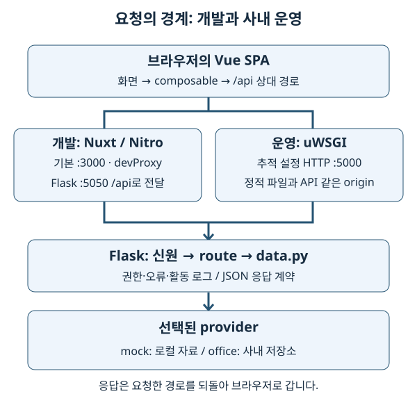
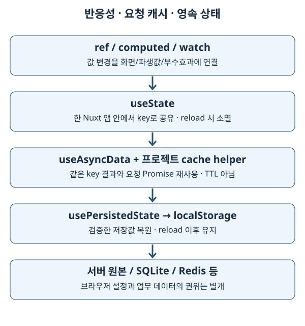
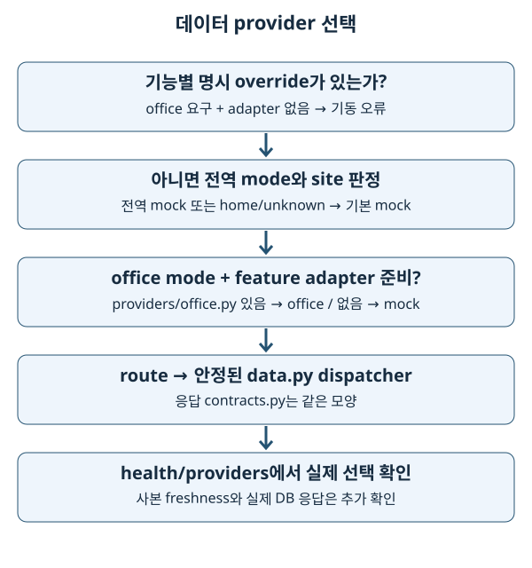

# SKEWNONO 구현을 설명하는 한국어 학습 공간

> **구현 기준일: 2026-10-03.** 기술 이름을 외우는 대신 ‘어느 코드가 어느 상태를 바꾸고, 요청이 어디로 가며, 변경을 어떻게 확인하는가’를 설명하는 것이 목표입니다. 기존 01~13과 보조 학습 주제를 유지하고 실행·운영·저장소 설명을 추가했습니다.

## 1. 기초 개념과 읽는 방법

이 시스템은 계측 장비의 데이터와 분석을 보여주는 웹 애플리케이션입니다. 브라우저의 Vue 화면, 개발·빌드 때 쓰는 Node 환경, 실제 API를 처리하는 Python/Flask, 사내 데이터 저장소가 서로 다른 책임을 가집니다. 먼저 아래 요청 그림에서 각 상자가 실행되는 위치를 말해 본 뒤 개별 장으로 들어갑니다.



HTML(Hypertext Markup Language)은 문서 구조를 표현하는 형식이며, CSS(Cascading Style Sheets)는 표시 스타일을 정합니다. HTML 최종 열람 형태는 [오프라인 학습 홈](index.html)입니다. 이 Markdown과 각 장의 Markdown은 수정 가능한 원본입니다. HTML은 각 원본의 같은 basename으로 생성되며 예를 들어 `03-nuxt/README.md`의 대응 파일은 `03-nuxt/README.html`입니다. 브라우저에서 `index.html`을 직접 열면 됩니다. `docs/study` 전체를 복사하면 본문·목차·그림이 오프라인에서도 작동합니다. 저장소 코드 링크는 저장소 전체가 있을 때 열 수 있고 외부 공식 문서 링크는 온라인 참고용입니다.

### 사실·개념·미확인을 구분합니다

- **구현 사실:** 실제 추적 파일·설정·테스트 또는 이번 로컬 버전 확인으로 뒷받침합니다. 코드 링크가 근거입니다.
- **일반 개념:** 프레임워크 공식 문서와 작은 예제로 설명합니다. 작은 교육 예제는 그대로 존재하는 runtime 코드와 구분합니다.
- **미확인 / OFFICE-VERIFY:** 사내 DB schema·active adapter·운영 설정·네트워크·권한처럼 집에서 입증하지 못한 내용입니다. template의 의도를 운영 검증 결과로 바꾸어 적지 않습니다.

SPA (Single Page Application)는 브라우저가 라우팅과 화면 구성을 맡는 앱입니다. SSR (Server-Side Rendering)은 서버가 화면 HTML을 렌더링하는 방식이며 이 저장소는 `ssr: false`입니다. API (Application Programming Interface)는 프로그램 간 입출력 약속입니다. 이후 약어는 각 장의 용어 설명에서 확인할 수 있습니다.

## 2. 버전을 읽는 법과 확인 결과

[frontend/package.json](../../frontend/package.json)은 허용 범위, [frontend/package-lock.json](../../frontend/package-lock.json)은 선택된 버전입니다. `^4.4.2`는 ‘반드시 4.4.2 설치’가 아닙니다. 아래 lock 버전과 원래 checkout의 실제 `node_modules` 버전은 이번 확인에서 같았습니다. 사내 설치 버전은 미확인입니다.

| 프런트엔드 패키지 | 선언 범위 | 잠금 파일 | 로컬 설치 확인 |
| --- | --- | --- | --- |
| Nuxt | `^4.4.2` | 4.5.0 | 4.5.0 |
| Vue | Nuxt의 전이 의존성 | 3.5.40 | 3.5.40 |
| Nuxt UI | `^4.6.1` | 4.10.0 | 4.10.0 |
| Tailwind CSS | `^4.1.18` | 4.3.3 | 4.3.3 |
| TypeScript | `^5.9.3` | 5.9.3 | 5.9.3 |
| Vite | Nuxt의 전이 의존성 | 8.1.5 | 8.1.5 |
| Nitro (`nitropack`) | Nuxt의 전이 의존성 | 2.13.4 | 2.13.4 |
| ESLint | `^9.39.2` | 9.39.5 | 9.39.5 |
| `@nuxt/eslint` | `^1.13.0` | 1.16.0 | 1.16.0 |
| ECharts | `^6.1.0` | 6.1.0 | 6.1.0 |
| ExcelJS | `^4.4.0` | 4.4.0 | 4.4.0 |

Python의 선언과 실제 설치는 다음과 같이 구분합니다.

| 백엔드 패키지 | requirements.txt 선언 | 로컬 .venv 확인 |
| --- | --- | --- |
| Flask | `>=3.0` | 3.1.3 |
| NumPy | `>=2` | 2.4.6 |
| pandas | `>=2.2.2` | 3.0.5 |
| PyArrow | `>=16` | 25.0.1 |
| APScheduler | `>=3.10` | 3.11.3 |

Python 잠금 파일은 발견되지 않았습니다. 따라서 위 값은 **로컬 관측값**이고 모든 설치의 고정 버전은 아닙니다. 전체 backend 선언에는 Redis·MinIO·OpenSearch·Pillow·HTTP 클라이언트·사내 RAG 의존성도 있습니다. 사용 여부와 역할은 [16장](16-storage-deployment/README.md)에 연결했습니다.

실행 환경은 로컬 CPython 3.11.14, Node 24.13.0을 확인했습니다. `packageManager` 선언은 `npm@11.9.0`이고, 선택한 Node 24 환경에서 실제 npm은 11.19.1입니다. [CI](../../.github/workflows/ci.yml)는 Node 24, Python 3.14를 사용합니다. CI 통과를 사무실 Python 3.11 검증과 같은 것으로 해석하지 않습니다. 공식 문서는 버전 계열을 확인하고 사용했으며, rolling 문서의 patch 설명은 설치 소스와 함께 확인해야 합니다.

## 3. 학습 순서와 장별 지도

처음에는 14장의 요청 흐름을 훑고 01→02→03→07→10을 읽습니다. 이 순서가 ‘타입 → 화면 상태 → 앱 구조 → 상태 수명 → 데이터 경계’를 연결합니다. 이후 UI·차트·통계·검증을 익히고 15→16으로 운영까지 확장합니다. Python 개발자는 10→14에서 시작해도 됩니다.

| 장 | 설명할 수 있게 되는 질문 | 원본 |
| --- | --- | --- |
| 01 TypeScript | 컴파일 때 확인하는 타입과 실제 HTTP 값이 왜 다른가? | [기본](01-typescript/README.md) · [타입 관리](01-typescript/02-type-management-conventions.md) · [빈 값](01-typescript/03-null-undefined-false-none-empty-string.md) |
| 02 Vue 반응성 | 값 변경이 어떻게 화면과 파생값으로 이어지는가? | [02](02-vue-basics/README.md) |
| 03 Nuxt SPA | 파일 route·오토임포트·요청 상태와 캐시의 범위는 무엇인가? | [03](03-nuxt/README.md) |
| 04 Nuxt UI | 컴포넌트 API·slot·접근성을 어떻게 조합하는가? | [04](04-nuxt-ui/README.md) |
| 05 Tailwind·토큰 | 레이아웃 utility와 의미 색상 토큰은 어떻게 나뉘는가? | [05](05-tailwind/README.md) |
| 06 Vite·Nitro·설정 | 개발 프록시와 정적 빌드는 왜 다른가? | [06](06-vite-config/README.md) |
| 07 코드 패턴 | 반응성·공유·캐시·영속성은 각각 언제 끝나는가? | [기본](07-code-patterns/README.md) · [장비 목록 캐시](07-code-patterns/sem-list-caching.md) · [영속 상태](07-code-patterns/persisted-state.md) |
| 08 ESLint | lint·타입 검사·실행 테스트는 무엇을 각각 잡는가? | [08](08-eslint-style/README.md) |
| 09 UI 용어 | 화면 개념과 사용자 문구를 어떻게 구분하는가? | [09](09-ui-terminology/README.md) |
| 10 Flask·provider | 환경 mode와 adapter 준비 상태가 어떻게 합쳐지는가? | [10](10-backend-providers/README.md) |
| 11 ECharts | 명령형 차트 API를 Vue lifecycle에 어떻게 잇는가? | [11](11-echarts-dataviz/README.md) |
| 12 통계·좌표 | 중심·산포·기준값·실제 좌표를 어떻게 구분하는가? | [12](12-statistics-wafer/README.md) |
| 13 테스트 경계 | 순수 함수·contract·browser·office 검증의 범위는 어디까지인가? | [13](13-testing/README.md) |
| 14 실행·HTTP | 브라우저부터 WSGI까지 한 요청을 설명할 수 있는가? | [14](14-runtime-http/README.md) |
| 15 프로세스·신원·운영 | 어떤 프로세스가 작업을 실행하며 권한·로그를 어떻게 남기는가? | [15](15-process-auth-operations/README.md) |
| 16 저장소·사내 배포 | 데이터 형식과 배포 파일의 수명은 어떻게 다른가? | [16](16-storage-deployment/README.md) |

## 4. 구현 선택을 연결해서 읽습니다



반응성이 있다는 말은 재로드 뒤에도 값이 남는다는 뜻이 아닙니다. `useState`는 현재 앱의 공유 상태, `useAsyncData`와 cache helper는 읽기 결과·요청의 재사용, `usePersistedState`는 검증한 localStorage 복원입니다. Pinia·TanStack Query가 없다는 사실도 실제 선택이며 새 추상화를 먼저 넣을 이유는 아닙니다. 구체적인 보존·갱신 한계는 07장에 있습니다.



기능의 응답 shape를 바꾸면 Python contracts·mock·office·frontend 타입·차트·테스트까지 영향이 이어집니다. 연결 호스트만 바꾸면 provider 설정 경계에 한정될 수 있습니다. ‘어디를 고칠까’에 답하기 전에 실제 호출 경로를 읽고 변경 범위를 정합니다.

## 5. 흔한 실수와 학습의 한계

- 문서나 주석의 예전 숫자를 현재 구현이라고 외우지 않습니다. 버전·파일 존재·테스트·명령을 다시 확인합니다.
- mock가 반환하는 예쁜 값은 사내 데이터 분포·결측·상관관계의 증거가 아닙니다.
- 타입 검사와 unit test 통과는 browser lifecycle이나 실제 저장소 연결을 입증하지 않습니다.
- 예제를 복사하면서 사내 secret·token·원본 계측 자료를 공개 문서에 넣지 않습니다.
- 프레임워크의 일반 동작과 이 저장소의 추가 helper 정책은 구분해서 읽습니다.

## 6. 안전한 학습과 확인

각 장의 실습은 읽기 전용 코드 추적, 작은 로컬 예제, 이미 준비된 mock 환경의 검사로 구성합니다. 사내 배포·삭제·동기화 명령은 실행 안내와 home 실습을 구분합니다. 명령은 특별한 표시가 없으면 저장소 루트에서 실행하고, `npm run …` 프런트엔드 명령은 `frontend`에서 실행합니다.

[질문 문서](questions.md)에 ‘예상한 흐름 → 실제로 읽은 파일 → 관측 결과 → 아직 모르는 점’을 기록합니다. 기존 Q1·Q2를 보존하고 현재 답을 연결했습니다. 자동 답변 스케줄의 현재 실행 여부는 확인되지 않았으므로 파일을 작성하면 자동 답이 생긴다고 약속하지 않습니다.

[검증 기록](verification.md)은 코드 대조, 초심자 점검, 링크·lint·실제 브라우저 검증을 구분합니다. 각 장을 읽은 뒤 표의 질문에 파일을 가리키며 답할 수 있다면 다음 장으로 넘어갑니다.

### HTML을 다시 생성합니다

설치된 root Markdown lint tooling의 `markdown-it`를 재사용합니다. 추가 패키지·CDN (Content Delivery Network)·웹폰트·원격 스크립트가 필요하지 않습니다. **저장소 루트**에서 실행하며 출력은 `docs/study`의 HTML만 갱신합니다.

```bash
node docs/study/build-html.mjs
node docs/study/check-site.mjs
npm run lint:md
```

먼저 `node --version`이 v24 계열인지 확인합니다. 이번 머신의 기본 Homebrew Node 25는 공유 라이브러리 `libllhttp.9.3.dylib`가 없어 기동하지 못했습니다. 검사에는 별도로 설치된 NVM(Node Version Manager)의 Node 24.13.0을 PATH 맨 앞에 두었습니다. 이것은 실행 환경 선택이며 저장소 의존성 변경이 아닙니다. 개인 환경에 맞게 Node 24 실행 파일을 선택한 뒤 위 명령을 사용합니다.

HTML은 별도로 내용 편집하지 않습니다. Markdown을 고친 뒤 재생성하면 heading·표·code·그림·링크가 같은 본문에서 만들어집니다. 각 HTML의 source hash와 `check-site.mjs`가 원본 일치와 로컬 링크를 검사합니다.

## 주요 근거

- [CLAUDE.md](../../CLAUDE.md), [Nuxt 설정](../../frontend/nuxt.config.ts), [Flask factory](../../backend/__init__.py), [requirements](../../backend/requirements.txt), [배포 문서](../deployment.md)
- 각 장의 ‘근거와 공식 문서’에는 해당 버전 계열의 동작 확인 링크가 있습니다. 외부 자료는 설명 근거이며 사이트가 로드할 실행 의존성이 아닙니다.

*최초 학습 공간 생성: 2026-04-16. 기존 문법 예제와 학습 질문을 이어서 보존한 전체 구현 대조: 2026-10-03.*
