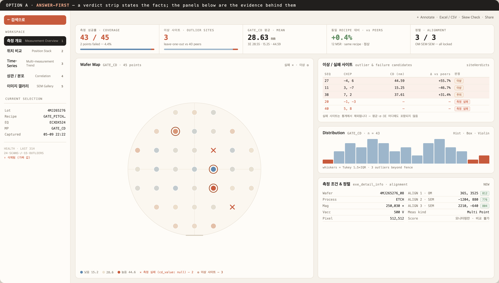
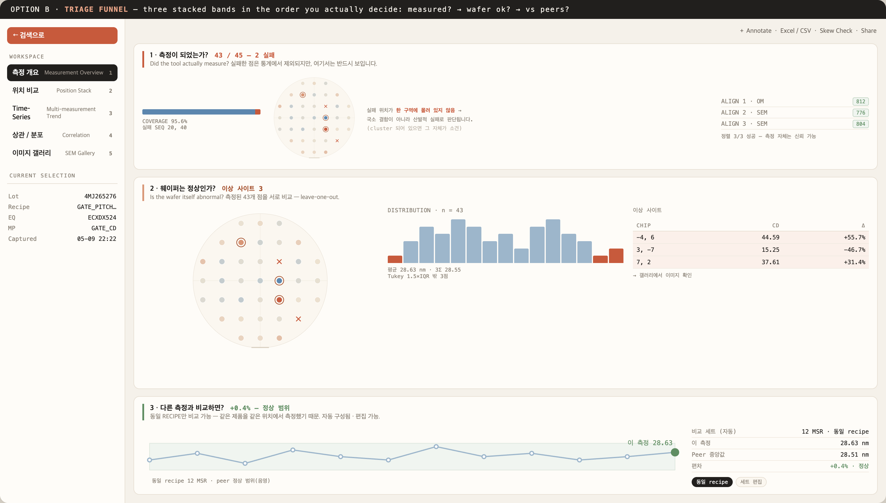
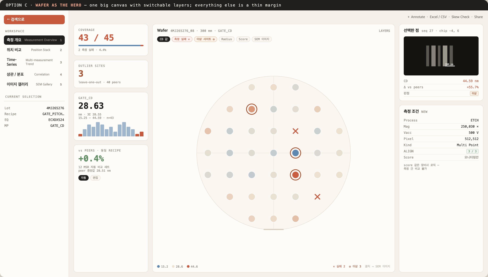

# 스큐보아 Phase B — 측정 개요 (Measurement Overview) Design

- Date: 2026-07-15
- Status: **Draft — 레이아웃 1개 결정 대기 중**
- Scope: `front-dev-home/app/components/ebeam/skewvoir/` (Dashboard → Measurement Overview)
- 선행 작업: Phase 0 + Phase A (`docs/superpowers/plans/2026-07-14-skewvoir-phase-a-analytical-truth.md`, 커밋 `4cf582a..9bd4ad6`)

## 1. 배경

Phase A에서 스큐보아의 **숫자**를 정직하게 만들었습니다.

- `cd_value`가 nullable이 되었습니다. `mp_number < 0`인 점은 측정이 없으므로 값도 없습니다.
- 모든 소비자가 `isMeasuredRow` 게이트를 통과합니다. 평균·σ·3Σ·이상 판정이 더 이상 가짜 값에 오염되지 않습니다.
- 통계가 `utils/stats.ts` 한 곳으로 모였습니다.

그러나 **부작용**이 하나 남았습니다. 게이트가 실패한 점을 조용히 버리기 때문에, 화면은 `43 sites`라고만 말합니다. 장비가 실제로 시도한 것은 45점이고 2점이 실패했다는 사실이 사라졌습니다. 통계는 정직해졌지만 **실패는 보이지 않게 되었습니다.**

Phase B는 이 관점을 뒤집습니다. 실패는 노이즈가 아니라 **증거**입니다.

## 2. 이 설계가 답하는 질문

> MSR은 측정의 산출물입니다. 산출물을 보고 좋은지 나쁜지 판단합니다.

판단하는 주체는 **사람**입니다. 앱의 역할은 판정을 내리는 것이 아니라, **판단 가능한 형태로 산출물을 제시하는 것**입니다.

## 3. 확정 사항

### 3.1 측정 실패의 정의 — `cd_value`가 null인 경우만

실패는 **점 데이터가 아예 없는 경우**(`mp_number < 0` → `cd_value: null`)로 한정합니다. 이는 `isMeasuredRow`의 부정과 정확히 같습니다. 규칙이 하나이고, 이미 구현·검증되어 있습니다.

다음은 실패로 **보지 않습니다**.

| 후보 | 판정 | 이유 |
| --- | --- | --- |
| 점 데이터 없음 (`cd_value: null`) | **실패** | 장비가 측정을 못 했습니다. |
| 측정됐으나 score 없음 | 실패 아님 | score는 장비사 로직입니다. |
| score가 낮음 | 실패 아님 | 임계값이 자의적입니다. |
| SEM 이미지 없음 | 실패 아님 | CD 값이 있으면 측정은 된 것입니다. |

### 3.2 `*_score`는 모니터링 대상이지 판정 근거가 아닙니다

`measurement_score` / `addressing1_score` / `addressing2_score`는 **장비사(vendor)의 자체 로직**으로 산출됩니다. 따라서 **측정 간 비교가 불가능합니다.** 화면에 표시하되(모니터링), 어떤 판정·정렬·임계값의 근거로도 사용하지 않습니다.

### 3.3 비교 가능성은 오직 동일 RECIPE 안에서만 성립합니다

같은 recipe는 **같은 제품을 같은 위치에서** 측정하므로 비교할 수 있습니다. 그래서 peer 그룹은 동일 recipe로 자동 구성합니다.

- **자동**: 열자마자 의미 있는 기준선이 있어야 합니다.
- **재정의 가능**: 기존 `비교 세트` 선택기(`TimeSeries.vue`)를 유지해 엔지니어가 세트를 편집할 수 있게 합니다.

### 3.4 `HEALTH · LAST 31H` 블록은 삭제합니다

`useSkewvoirWorkspace.ts:59`의 `useState(..., () => ({ scans: 24, outliers: 15 }))`는 **하드코딩된 가짜 값**이며 지금 사용자에게 그대로 노출되고 있습니다. LeftRail의 역할은 내비게이션과 현재 선택 표시입니다. 측정의 실제 사실(커버리지·이상 사이트)은 본문 뷰에서 보여줍니다.

## 4. 범위 분할

Phase B 백로그는 하나의 spec으로 묶기에 너무 큽니다. 서로 다른 질문에 답하기 때문입니다. 각각 독립된 spec → plan → 구현 사이클을 갖습니다.

| | 하위 과제 | 답하는 질문 | 사용하는 자산 |
| --- | --- | --- | --- |
| **B1** | 측정 개요 | 이 측정은 쓸 만한가? | 실패 가시화, `siteVerdicts`, `exe_detail_info`, `alignment` |
| **B2** | Peer 비교 | 이 웨이퍼가 recipe 동료 대비 이상한가? | 동일 recipe 자동 기준선, delta map |
| **B3** | 장비 증거 (FDC) | 장비가 원인인가? | 고아 상태인 `Fdc*` 4개 컴포넌트, CD↔FDC 상관 |
| **B4** | 갤러리 정리 | 어떤 이미지부터 볼 것인가? | 정렬·필터·비교, `siteVerdicts` |

**B1을 먼저 진행합니다.** 실패한 측정은 애초에 비교할 가치가 없으므로, 분류 깔때기의 입구입니다.

## 5. B1 — 측정 개요 상세

### 5.1 반드시 담기는 것

1. **커버리지(실패)를 1급 정보로.** 모든 개수 표기가 정직해집니다. `43 sites` → `43 / 45 측정 · 2 실패`.
2. **실패 점의 위치.** 실패 행도 `chip_number` / `sequence`를 그대로 갖고 있으므로 웨이퍼 맵에 `✕`로 찍을 수 있습니다. **실패가 한 구역에 뭉쳐 있다면 그 자체가 소견입니다.**
3. **사이트 이상 판정.** Phase A에서 만들었지만 아직 아무 뷰도 쓰지 않는 `utils/anomaly/site.ts::siteVerdicts`를 여기서 처음 소비합니다. leave-one-out 기준이며, 앱 전체에서 "이상"의 정의는 하나뿐입니다.
4. **측정 조건 + 정렬 증거.** Phase 0이 열어준 `exe_detail_info`(wafer/process/mag/vacc/pixel)와 `alignment`(3점, OM/SEM, offset, score)를 표시합니다. 현재 `Acquisition.vue`는 `meas_hist` 행을 쓰고 있어 이 데이터를 아직 보지 않습니다.
5. **동일 recipe 대비 편차.** 자동 peer 세트 기준의 delta 한 줄.

### 5.2 담지 않는 것

- `spm_dict` — **신호가 없는 자리표시자입니다.** 사무실 백엔드가 실제 파형을 주기 전에는 어떤 패널도 만들지 않습니다.
- `MsrFileResponse.health` — mock 생성기의 내부 편향 스칼라이며 사무실 백엔드에는 존재하지 않습니다.
- score 기반 임계값·정렬·판정 (§3.2).

## 6. 레이아웃 3안 — **결정 대기**

세 안 모두 §5의 정보를 담습니다. 차이는 **무엇을 먼저 읽게 하는가**입니다.

### 안 A — Answer-first (`docs/design/2026-07-15-skewvoir-phase-b/option-a-answer-first.png`)

상단에 판정 스트립(커버리지 · 이상 사이트 · 평균 · peer 대비 · 정렬)이 사실을 먼저 선언하고, 아래 패널들이 그 근거가 됩니다. 현재 Dashboard 구조와 가장 가깝습니다.

### 안 B — Triage funnel (`docs/design/2026-07-15-skewvoir-phase-b/option-b-triage-funnel.png`)

판단 순서 그대로 3개 밴드를 쌓습니다. ① 측정이 되었는가 → ② 웨이퍼는 정상인가 → ③ 다른 측정과 비교하면. 화면이 곧 사고 절차입니다. 다만 세로로 길어 스크롤이 필요합니다.

### 안 C — Wafer as the hero (`docs/design/2026-07-15-skewvoir-phase-b/option-c-wafer-hero.png`)

웨이퍼 맵 하나를 중앙에 크게 두고 레이어(CD 값 / 실패 / 이상 / Radius / Score / 이미지)를 토글합니다. 점을 클릭하면 우측에 해당 SEM 이미지와 판정이 나옵니다. 좌우는 얇은 여백 정보입니다.

### 트레이드오프

| | 강점 | 약점 |
| --- | --- | --- |
| A | 한눈에 결론. 기존 구조와 연속적입니다. | 스트립이 "판정"처럼 읽혀 사람의 판단을 앞지를 수 있습니다. |
| B | 판단 순서를 화면이 강제합니다. 신규 사용자에게 친절합니다. | 세로로 깁니다. 숙련자에게는 느립니다. |
| C | 웨이퍼가 주인공. 점↔이미지 탐색이 즉각적입니다. | 분포·추세가 주변부로 밀립니다. |

> **결정해 주실 항목은 이 하나입니다: A / B / C (또는 혼합).** 나머지 §3~§5는 확정되었습니다.

## 7. 검증

- 실패 사이트가 통계에 **절대** 포함되지 않아야 합니다 (Phase A의 게이트 유지, 회귀 금지).
- 실패 개수는 백엔드 payload와 일치해야 합니다 (`45 raw − 43 measured = 2`).
- `siteVerdicts`의 `status`(판정 수행 여부)와 `severity`(이상 정도)는 계속 분리된 축입니다.
- 레이아웃 변경이므로 Phase A의 "레이아웃 불변" 제약은 여기서 해제됩니다. 단, 숫자의 의미는 바뀌지 않습니다.

## 8. 열린 질문 (구현 전 확인 필요)

1. 자동 peer 세트의 크기·기간 기본값은 얼마입니까? (예: 동일 recipe 최근 30일 / 최대 30 MSR)
2. peer 세트는 **모든 장비**를 한 풀로 봅니까, 아니면 동일 장비 / 타 장비를 나눕니까? §3.3에서는 한 풀로 두었으나, 장비 skew는 별도 `Skew Check` 기능의 영역일 수 있습니다.
